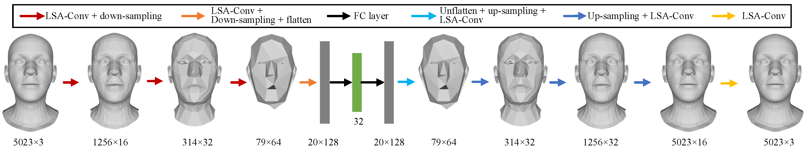

# Project Abstract 
Demand for efficient 3D shape representation learning is increasing in many 3D computer vision applications. The recent success of convolutional neural networks (CNNs) for image analysis suggests the value of adapting insight from CNN to 3D shapes. However, unlike images that are Euclidean structured, 3D shape data are irregular since each node's neighbors are inconsistent. Various convolutional graph neural networks for 3D shapes have been developed using isotropic filters or using anisotropic filters with predefined local coordinate systems to overcome the node inconsistency on graphs. However, isotropic filters or predefined local coordinate systems limit the representation power. In this paper, we propose a permutable anisotropic convolutional operation (PAI-Conv) that learns adaptive soft-permutation matrices for each node according to the geometric shape of its neighbors and performs shared anisotropic filters as CNN does. Comprehensive experiments demonstrate that our model produces significant improvement in 3D shape reconstruction compared to state-of-the-art methods.

[Arxiv link](https://arxiv.org/abs/2004.09995)


# Repository Requirements

This code was written in Pytorch 1.1. We use tensorboardX for the visualisation of the training metrics. We recommend setting up a virtual environment using [Miniconda](https://docs.conda.io/en/latest/miniconda.html). To install Pytorch in a conda environment, simply run 

```
$ conda install pytorch torchvision -c pytorch
```

Then the rest of the requirements can be installed with 

```
$ pip install -r requirements.txt
```

### Mesh Decimation
For the mesh decimation code we use a function from the [COMA repository](https://github.com/anuragranj/coma) (the files **mesh_sampling.py** and **shape_data.py** - previously **facemesh.py** - were taken from the COMA repo and adapted to our needs). In order to decimate your template mesh, you will need the [MPI-Mesh](https://github.com/MPI-IS/mesh) package (a mesh library similar to Trimesh or Open3D).  This package requires Python 2. However once you have cached the generated downsampling and upsampling matrices, it is possible to run the rest of the code with Python 3 as well, if necessary.


# Data Organization

The following is the organization of the dataset directories expected by the code:

* data **root_dir**/
  * **dataset** name/ (eg DFAUST)
    * template
      * template.obj (all of the spiraling and downsampling code is run on the template only once)
      * downsample_method/
        * downsampling_matrices.pkl (created by the code the first time you run it)
    * preprocessed/
      * train.npy (number_meshes, number_vertices, 3) (no Faces because they all share topology)
      * test.npy 
      * points_train/ (created by data_generation.py)
      * points_val/ (created by data_generation.py)
      * points_test/ (created by data_generation.py)
      * paths_train.npy (created by data_generation.py)
      * paths_val.npy (created by data_generation.py)
      * paths_test.npy (created by data_generation.py)

# Usage

#### Data preprocessing 

In order to use a pytorch dataloader for training and testing, we split the data into seperate files by:

```
$ python data_generation.py --root_dir=/path/to/data_root_dir --dataset=DFAUST --num_valid=100
```

#### Training and Testing

```
args['mode'] = 'train' or 'test'
```

#### Some important notes:
* The code has compatibility with both _mpi-mesh_ and _trimesh_ packages (it can be chosen by setting the _meshpackage_ variable in the first cell of the notebook).

#### Acknowlegements:

The structure of this codebase is borrowed from [Neural3DMM](https://github.com/gbouritsas/Neural3DMMt).

# Cite

Please consider citing our work if you find it useful:

```
@misc{gao2020paigcn,
    title={PAI-GCN: Permutable Anisotropic Graph Convolutional Networks for 3D Shape Representation Learning},
    author={Zhongpai Gao and Guangtao Zhai and Juyong Zhang and Yiyan Yang and Xiaokang Yang},
    year={2020},
    eprint={2004.09995},
    archivePrefix={arXiv},
    primaryClass={cs.CV}
}
```